# House Pricing Prediction - a Kaggle Competition

In this project, we will predict house prices in a Kaggle competition using the dataset of residential homes in Ames, Iowa. There are 79 variables describing most of the aspects of the homes and we will try to utilize all these information to make a better prediction.

Submissions are evaluated on Root-Mean-Squared-Error (RMSE) between the logarithm of the predicted value and the logarithm of the observed sales price. (Taking logs means that errors in predicting expensive houses and cheap houses will affect the result equally.)

## 1. Importing Libraries

Let's start with importing the libraries we will need in this project. 


```python
## Importing libraries

import numpy as np 
import pandas as pd
from sklearn.impute import SimpleImputer
from sklearn.compose import ColumnTransformer
from sklearn.pipeline import Pipeline, make_pipeline
from sklearn.preprocessing import OneHotEncoder
from sklearn.ensemble import RandomForestRegressor, GradientBoostingRegressor
from sklearn.metrics import mean_squared_error, mean_absolute_error
from xgboost import XGBRegressor
from sklearn.linear_model import LassoCV
from sklearn import metrics
from sklearn.model_selection import cross_val_score, train_test_split
from scipy.stats import skew
import matplotlib.pyplot as plt
import seaborn as sns

```

## 2. Reading and Understanding Data

In this section, we will read the data into notebook and have some fundamental perspective about the data.

### 2.1 Reading Data

We have 2 separate files to use. First file is the main data we will train our model with. Second file is the data we will test our model on.


```python
## Reading the training data using 'Id' column as index
train_data = pd.read_csv('train.csv',index_col='Id')

## Reading the test data using 'Id' column as index
test_data = pd.read_csv('test.csv',index_col='Id')
```

### 2.2 Understanding Data

Let's have a quick look at the data to overview the size, the columns and a concise summary.


```python
## First 5 rows of Train data
print("Train Data Overview:")
train_data.head()
```

    Train Data Overview:
    


<div>
<style scoped>
    .dataframe tbody tr th:only-of-type {
        vertical-align: middle;
    }

    .dataframe tbody tr th {
        vertical-align: top;
    }

    .dataframe thead th {
        text-align: right;
    }
</style>
<table border="1" class="dataframe">
  <thead>
    <tr style="text-align: right;">
      <th></th>
      <th>MSSubClass</th>
      <th>MSZoning</th>
      <th>LotFrontage</th>
      <th>LotArea</th>
      <th>Street</th>
      <th>Alley</th>
      <th>LotShape</th>
      <th>LandContour</th>
      <th>Utilities</th>
      <th>LotConfig</th>
      <th>...</th>
      <th>PoolArea</th>
      <th>PoolQC</th>
      <th>Fence</th>
      <th>MiscFeature</th>
      <th>MiscVal</th>
      <th>MoSold</th>
      <th>YrSold</th>
      <th>SaleType</th>
      <th>SaleCondition</th>
      <th>SalePrice</th>
    </tr>
    <tr>
      <th>Id</th>
      <th></th>
      <th></th>
      <th></th>
      <th></th>
      <th></th>
      <th></th>
      <th></th>
      <th></th>
      <th></th>
      <th></th>
      <th></th>
      <th></th>
      <th></th>
      <th></th>
      <th></th>
      <th></th>
      <th></th>
      <th></th>
      <th></th>
      <th></th>
      <th></th>
    </tr>
  </thead>
  <tbody>
    <tr>
      <th>1</th>
      <td>60</td>
      <td>RL</td>
      <td>65.0</td>
      <td>8450</td>
      <td>Pave</td>
      <td>NaN</td>
      <td>Reg</td>
      <td>Lvl</td>
      <td>AllPub</td>
      <td>Inside</td>
      <td>...</td>
      <td>0</td>
      <td>NaN</td>
      <td>NaN</td>
      <td>NaN</td>
      <td>0</td>
      <td>2</td>
      <td>2008</td>
      <td>WD</td>
      <td>Normal</td>
      <td>208500</td>
    </tr>
    <tr>
      <th>2</th>
      <td>20</td>
      <td>RL</td>
      <td>80.0</td>
      <td>9600</td>
      <td>Pave</td>
      <td>NaN</td>
      <td>Reg</td>
      <td>Lvl</td>
      <td>AllPub</td>
      <td>FR2</td>
      <td>...</td>
      <td>0</td>
      <td>NaN</td>
      <td>NaN</td>
      <td>NaN</td>
      <td>0</td>
      <td>5</td>
      <td>2007</td>
      <td>WD</td>
      <td>Normal</td>
      <td>181500</td>
    </tr>
    <tr>
      <th>3</th>
      <td>60</td>
      <td>RL</td>
      <td>68.0</td>
      <td>11250</td>
      <td>Pave</td>
      <td>NaN</td>
      <td>IR1</td>
      <td>Lvl</td>
      <td>AllPub</td>
      <td>Inside</td>
      <td>...</td>
      <td>0</td>
      <td>NaN</td>
      <td>NaN</td>
      <td>NaN</td>
      <td>0</td>
      <td>9</td>
      <td>2008</td>
      <td>WD</td>
      <td>Normal</td>
      <td>223500</td>
    </tr>
    <tr>
      <th>4</th>
      <td>70</td>
      <td>RL</td>
      <td>60.0</td>
      <td>9550</td>
      <td>Pave</td>
      <td>NaN</td>
      <td>IR1</td>
      <td>Lvl</td>
      <td>AllPub</td>
      <td>Corner</td>
      <td>...</td>
      <td>0</td>
      <td>NaN</td>
      <td>NaN</td>
      <td>NaN</td>
      <td>0</td>
      <td>2</td>
      <td>2006</td>
      <td>WD</td>
      <td>Abnorml</td>
      <td>140000</td>
    </tr>
    <tr>
      <th>5</th>
      <td>60</td>
      <td>RL</td>
      <td>84.0</td>
      <td>14260</td>
      <td>Pave</td>
      <td>NaN</td>
      <td>IR1</td>
      <td>Lvl</td>
      <td>AllPub</td>
      <td>FR2</td>
      <td>...</td>
      <td>0</td>
      <td>NaN</td>
      <td>NaN</td>
      <td>NaN</td>
      <td>0</td>
      <td>12</td>
      <td>2008</td>
      <td>WD</td>
      <td>Normal</td>
      <td>250000</td>
    </tr>
  </tbody>
</table>
<p>5 rows × 80 columns</p>
</div>


```python
## First 5 rows of Test data
print("Test Data Overview:")
test_data.head()
```

    Test Data Overview:
    


<div>
<style scoped>
    .dataframe tbody tr th:only-of-type {
        vertical-align: middle;
    }

    .dataframe tbody tr th {
        vertical-align: top;
    }

    .dataframe thead th {
        text-align: right;
    }
</style>
<table border="1" class="dataframe">
  <thead>
    <tr style="text-align: right;">
      <th></th>
      <th>MSSubClass</th>
      <th>MSZoning</th>
      <th>LotFrontage</th>
      <th>LotArea</th>
      <th>Street</th>
      <th>Alley</th>
      <th>LotShape</th>
      <th>LandContour</th>
      <th>Utilities</th>
      <th>LotConfig</th>
      <th>...</th>
      <th>ScreenPorch</th>
      <th>PoolArea</th>
      <th>PoolQC</th>
      <th>Fence</th>
      <th>MiscFeature</th>
      <th>MiscVal</th>
      <th>MoSold</th>
      <th>YrSold</th>
      <th>SaleType</th>
      <th>SaleCondition</th>
    </tr>
    <tr>
      <th>Id</th>
      <th></th>
      <th></th>
      <th></th>
      <th></th>
      <th></th>
      <th></th>
      <th></th>
      <th></th>
      <th></th>
      <th></th>
      <th></th>
      <th></th>
      <th></th>
      <th></th>
      <th></th>
      <th></th>
      <th></th>
      <th></th>
      <th></th>
      <th></th>
      <th></th>
    </tr>
  </thead>
  <tbody>
    <tr>
      <th>1461</th>
      <td>20</td>
      <td>RH</td>
      <td>80.0</td>
      <td>11622</td>
      <td>Pave</td>
      <td>NaN</td>
      <td>Reg</td>
      <td>Lvl</td>
      <td>AllPub</td>
      <td>Inside</td>
      <td>...</td>
      <td>120</td>
      <td>0</td>
      <td>NaN</td>
      <td>MnPrv</td>
      <td>NaN</td>
      <td>0</td>
      <td>6</td>
      <td>2010</td>
      <td>WD</td>
      <td>Normal</td>
    </tr>
    <tr>
      <th>1462</th>
      <td>20</td>
      <td>RL</td>
      <td>81.0</td>
      <td>14267</td>
      <td>Pave</td>
      <td>NaN</td>
      <td>IR1</td>
      <td>Lvl</td>
      <td>AllPub</td>
      <td>Corner</td>
      <td>...</td>
      <td>0</td>
      <td>0</td>
      <td>NaN</td>
      <td>NaN</td>
      <td>Gar2</td>
      <td>12500</td>
      <td>6</td>
      <td>2010</td>
      <td>WD</td>
      <td>Normal</td>
    </tr>
    <tr>
      <th>1463</th>
      <td>60</td>
      <td>RL</td>
      <td>74.0</td>
      <td>13830</td>
      <td>Pave</td>
      <td>NaN</td>
      <td>IR1</td>
      <td>Lvl</td>
      <td>AllPub</td>
      <td>Inside</td>
      <td>...</td>
      <td>0</td>
      <td>0</td>
      <td>NaN</td>
      <td>MnPrv</td>
      <td>NaN</td>
      <td>0</td>
      <td>3</td>
      <td>2010</td>
      <td>WD</td>
      <td>Normal</td>
    </tr>
    <tr>
      <th>1464</th>
      <td>60</td>
      <td>RL</td>
      <td>78.0</td>
      <td>9978</td>
      <td>Pave</td>
      <td>NaN</td>
      <td>IR1</td>
      <td>Lvl</td>
      <td>AllPub</td>
      <td>Inside</td>
      <td>...</td>
      <td>0</td>
      <td>0</td>
      <td>NaN</td>
      <td>NaN</td>
      <td>NaN</td>
      <td>0</td>
      <td>6</td>
      <td>2010</td>
      <td>WD</td>
      <td>Normal</td>
    </tr>
    <tr>
      <th>1465</th>
      <td>120</td>
      <td>RL</td>
      <td>43.0</td>
      <td>5005</td>
      <td>Pave</td>
      <td>NaN</td>
      <td>IR1</td>
      <td>HLS</td>
      <td>AllPub</td>
      <td>Inside</td>
      <td>...</td>
      <td>144</td>
      <td>0</td>
      <td>NaN</td>
      <td>NaN</td>
      <td>NaN</td>
      <td>0</td>
      <td>1</td>
      <td>2010</td>
      <td>WD</td>
      <td>Normal</td>
    </tr>
  </tbody>
</table>
<p>5 rows × 79 columns</p>
</div>


```python
## Size of Train data and Test data
print("Train Data Size (Rows, Columns):")
print(train_data.shape, )
print("\nTest Data Size (Rows, Columns):")
print(test_data.shape, )
```

    Train Data Size (Rows, Columns):
    (1460, 80)
    
    Test Data Size (Rows, Columns):
    (1459, 79)
    


```python
## Concise summary of Train data
train_data.info()
```

    <class 'pandas.core.frame.DataFrame'>
    Int64Index: 1460 entries, 1 to 1460
    Data columns (total 80 columns):
     #   Column         Non-Null Count  Dtype  
    ---  ------         --------------  -----  
     0   MSSubClass     1460 non-null   int64  
     1   MSZoning       1460 non-null   object 
     2   LotFrontage    1201 non-null   float64
     3   LotArea        1460 non-null   int64  
     4   Street         1460 non-null   object 
     5   Alley          91 non-null     object 
     6   LotShape       1460 non-null   object 
     7   LandContour    1460 non-null   object 
     8   Utilities      1460 non-null   object 
     9   LotConfig      1460 non-null   object 
     10  LandSlope      1460 non-null   object 
     11  Neighborhood   1460 non-null   object 
     12  Condition1     1460 non-null   object 
     13  Condition2     1460 non-null   object 
     14  BldgType       1460 non-null   object 
     15  HouseStyle     1460 non-null   object 
     16  OverallQual    1460 non-null   int64  
     17  OverallCond    1460 non-null   int64  
     18  YearBuilt      1460 non-null   int64  
     19  YearRemodAdd   1460 non-null   int64  
     20  RoofStyle      1460 non-null   object 
     21  RoofMatl       1460 non-null   object 
     22  Exterior1st    1460 non-null   object 
     23  Exterior2nd    1460 non-null   object 
     24  MasVnrType     1452 non-null   object 
     25  MasVnrArea     1452 non-null   float64
     26  ExterQual      1460 non-null   object 
     27  ExterCond      1460 non-null   object 
     28  Foundation     1460 non-null   object 
     29  BsmtQual       1423 non-null   object 
     30  BsmtCond       1423 non-null   object 
     31  BsmtExposure   1422 non-null   object 
     32  BsmtFinType1   1423 non-null   object 
     33  BsmtFinSF1     1460 non-null   int64  
     34  BsmtFinType2   1422 non-null   object 
     35  BsmtFinSF2     1460 non-null   int64  
     36  BsmtUnfSF      1460 non-null   int64  
     37  TotalBsmtSF    1460 non-null   int64  
     38  Heating        1460 non-null   object 
     39  HeatingQC      1460 non-null   object 
     40  CentralAir     1460 non-null   object 
     41  Electrical     1459 non-null   object 
     42  1stFlrSF       1460 non-null   int64  
     43  2ndFlrSF       1460 non-null   int64  
     44  LowQualFinSF   1460 non-null   int64  
     45  GrLivArea      1460 non-null   int64  
     46  BsmtFullBath   1460 non-null   int64  
     47  BsmtHalfBath   1460 non-null   int64  
     48  FullBath       1460 non-null   int64  
     49  HalfBath       1460 non-null   int64  
     50  BedroomAbvGr   1460 non-null   int64  
     51  KitchenAbvGr   1460 non-null   int64  
     52  KitchenQual    1460 non-null   object 
     53  TotRmsAbvGrd   1460 non-null   int64  
     54  Functional     1460 non-null   object 
     55  Fireplaces     1460 non-null   int64  
     56  FireplaceQu    770 non-null    object 
     57  GarageType     1379 non-null   object 
     58  GarageYrBlt    1379 non-null   float64
     59  GarageFinish   1379 non-null   object 
     60  GarageCars     1460 non-null   int64  
     61  GarageArea     1460 non-null   int64  
     62  GarageQual     1379 non-null   object 
     63  GarageCond     1379 non-null   object 
     64  PavedDrive     1460 non-null   object 
     65  WoodDeckSF     1460 non-null   int64  
     66  OpenPorchSF    1460 non-null   int64  
     67  EnclosedPorch  1460 non-null   int64  
     68  3SsnPorch      1460 non-null   int64  
     69  ScreenPorch    1460 non-null   int64  
     70  PoolArea       1460 non-null   int64  
     71  PoolQC         7 non-null      object 
     72  Fence          281 non-null    object 
     73  MiscFeature    54 non-null     object 
     74  MiscVal        1460 non-null   int64  
     75  MoSold         1460 non-null   int64  
     76  YrSold         1460 non-null   int64  
     77  SaleType       1460 non-null   object 
     78  SaleCondition  1460 non-null   object 
     79  SalePrice      1460 non-null   int64  
    dtypes: float64(3), int64(34), object(43)
    memory usage: 923.9+ KB
    


```python
## Concise summary of Test data
test_data.info()
```

    <class 'pandas.core.frame.DataFrame'>
    Int64Index: 1459 entries, 1461 to 2919
    Data columns (total 79 columns):
     #   Column         Non-Null Count  Dtype  
    ---  ------         --------------  -----  
     0   MSSubClass     1459 non-null   int64  
     1   MSZoning       1455 non-null   object 
     2   LotFrontage    1232 non-null   float64
     3   LotArea        1459 non-null   int64  
     4   Street         1459 non-null   object 
     5   Alley          107 non-null    object 
     6   LotShape       1459 non-null   object 
     7   LandContour    1459 non-null   object 
     8   Utilities      1457 non-null   object 
     9   LotConfig      1459 non-null   object 
     10  LandSlope      1459 non-null   object 
     11  Neighborhood   1459 non-null   object 
     12  Condition1     1459 non-null   object 
     13  Condition2     1459 non-null   object 
     14  BldgType       1459 non-null   object 
     15  HouseStyle     1459 non-null   object 
     16  OverallQual    1459 non-null   int64  
     17  OverallCond    1459 non-null   int64  
     18  YearBuilt      1459 non-null   int64  
     19  YearRemodAdd   1459 non-null   int64  
     20  RoofStyle      1459 non-null   object 
     21  RoofMatl       1459 non-null   object 
     22  Exterior1st    1458 non-null   object 
     23  Exterior2nd    1458 non-null   object 
     24  MasVnrType     1443 non-null   object 
     25  MasVnrArea     1444 non-null   float64
     26  ExterQual      1459 non-null   object 
     27  ExterCond      1459 non-null   object 
     28  Foundation     1459 non-null   object 
     29  BsmtQual       1415 non-null   object 
     30  BsmtCond       1414 non-null   object 
     31  BsmtExposure   1415 non-null   object 
     32  BsmtFinType1   1417 non-null   object 
     33  BsmtFinSF1     1458 non-null   float64
     34  BsmtFinType2   1417 non-null   object 
     35  BsmtFinSF2     1458 non-null   float64
     36  BsmtUnfSF      1458 non-null   float64
     37  TotalBsmtSF    1458 non-null   float64
     38  Heating        1459 non-null   object 
     39  HeatingQC      1459 non-null   object 
     40  CentralAir     1459 non-null   object 
     41  Electrical     1459 non-null   object 
     42  1stFlrSF       1459 non-null   int64  
     43  2ndFlrSF       1459 non-null   int64  
     44  LowQualFinSF   1459 non-null   int64  
     45  GrLivArea      1459 non-null   int64  
     46  BsmtFullBath   1457 non-null   float64
     47  BsmtHalfBath   1457 non-null   float64
     48  FullBath       1459 non-null   int64  
     49  HalfBath       1459 non-null   int64  
     50  BedroomAbvGr   1459 non-null   int64  
     51  KitchenAbvGr   1459 non-null   int64  
     52  KitchenQual    1458 non-null   object 
     53  TotRmsAbvGrd   1459 non-null   int64  
     54  Functional     1457 non-null   object 
     55  Fireplaces     1459 non-null   int64  
     56  FireplaceQu    729 non-null    object 
     57  GarageType     1383 non-null   object 
     58  GarageYrBlt    1381 non-null   float64
     59  GarageFinish   1381 non-null   object 
     60  GarageCars     1458 non-null   float64
     61  GarageArea     1458 non-null   float64
     62  GarageQual     1381 non-null   object 
     63  GarageCond     1381 non-null   object 
     64  PavedDrive     1459 non-null   object 
     65  WoodDeckSF     1459 non-null   int64  
     66  OpenPorchSF    1459 non-null   int64  
     67  EnclosedPorch  1459 non-null   int64  
     68  3SsnPorch      1459 non-null   int64  
     69  ScreenPorch    1459 non-null   int64  
     70  PoolArea       1459 non-null   int64  
     71  PoolQC         3 non-null      object 
     72  Fence          290 non-null    object 
     73  MiscFeature    51 non-null     object 
     74  MiscVal        1459 non-null   int64  
     75  MoSold         1459 non-null   int64  
     76  YrSold         1459 non-null   int64  
     77  SaleType       1458 non-null   object 
     78  SaleCondition  1459 non-null   object 
    dtypes: float64(11), int64(25), object(43)
    memory usage: 911.9+ KB
    

### 2.3 Missing Values

It is important to check if there are any missing values in the dataset. 


```python
## Missing values in Train data
missing = train_data.isnull().sum()
missing = missing[missing > 0]
missing.sort_values(inplace=True)
missing.plot.bar(title='Missing Values in Train Data', grid=1)
```


    <matplotlib.axes._subplots.AxesSubplot at 0x13bf4c0f0f0>


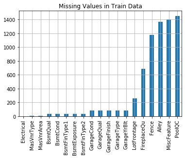


## 3. Data Visualization

Visualized data helps a lot to improve understanding of the data. We will produce figures to display the distribution of data in every column, as well as univariate and bivariate analysis of data.

### 3.1 Columns

We will start by identifying columns with type of the values they have: numerical or categorical.
This step will be the base of our approach while modelling the data.


```python
## Identifying numerical features by excluding the columns having dtype as 'object' and dropping 'SalePrice' column
numerical_features = train_data.select_dtypes(exclude=['object']).drop(['SalePrice'], axis=1).copy()
print(numerical_features.columns)
```

    Index(['MSSubClass', 'LotFrontage', 'LotArea', 'OverallQual', 'OverallCond',
           'YearBuilt', 'YearRemodAdd', 'MasVnrArea', 'BsmtFinSF1', 'BsmtFinSF2',
           'BsmtUnfSF', 'TotalBsmtSF', '1stFlrSF', '2ndFlrSF', 'LowQualFinSF',
           'GrLivArea', 'BsmtFullBath', 'BsmtHalfBath', 'FullBath', 'HalfBath',
           'BedroomAbvGr', 'KitchenAbvGr', 'TotRmsAbvGrd', 'Fireplaces',
           'GarageYrBlt', 'GarageCars', 'GarageArea', 'WoodDeckSF', 'OpenPorchSF',
           'EnclosedPorch', '3SsnPorch', 'ScreenPorch', 'PoolArea', 'MiscVal',
           'MoSold', 'YrSold'],
          dtype='object')
    


```python
## Identifying categorical features by including the columns having dtype as 'object'
categorical_features = train_data.select_dtypes(include=['object']).copy()
print(categorical_features.columns)
```

    Index(['MSZoning', 'Street', 'Alley', 'LotShape', 'LandContour', 'Utilities',
           'LotConfig', 'LandSlope', 'Neighborhood', 'Condition1', 'Condition2',
           'BldgType', 'HouseStyle', 'RoofStyle', 'RoofMatl', 'Exterior1st',
           'Exterior2nd', 'MasVnrType', 'ExterQual', 'ExterCond', 'Foundation',
           'BsmtQual', 'BsmtCond', 'BsmtExposure', 'BsmtFinType1', 'BsmtFinType2',
           'Heating', 'HeatingQC', 'CentralAir', 'Electrical', 'KitchenQual',
           'Functional', 'FireplaceQu', 'GarageType', 'GarageFinish', 'GarageQual',
           'GarageCond', 'PavedDrive', 'PoolQC', 'Fence', 'MiscFeature',
           'SaleType', 'SaleCondition'],
          dtype='object')
    

### 3.2 Distribution of Data

Let's see the distribution of data in every numerical feature.


```python
fig = plt.figure(figsize=(12,18))
sns.set_style("darkgrid")
for i in range(len(numerical_features.columns)):
    fig.add_subplot(9,4,i+1)
    sns.distplot(numerical_features.iloc[:,i].dropna(), rug=True, hist=False, kde_kws={'bw':0.1})
    plt.xlabel(numerical_features.columns[i])
plt.tight_layout()
plt.show()
```


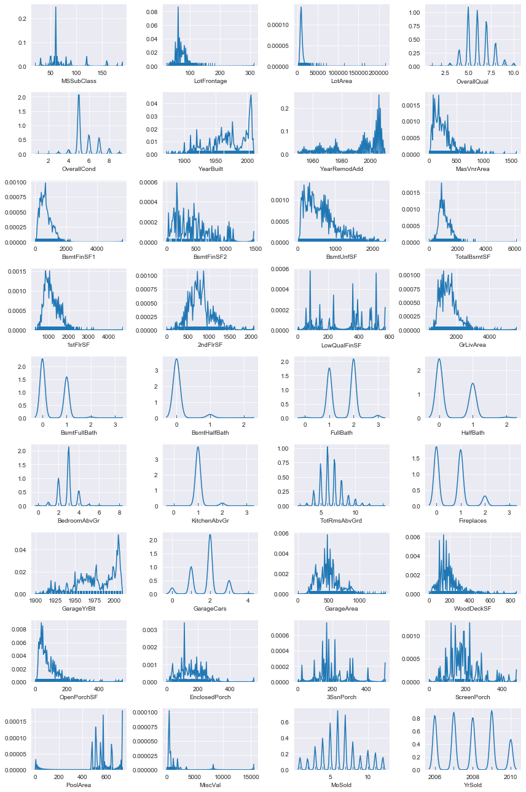


### 3.3 Univariate Analysis

First we will start with single variable analysis. We will summarize and find patterns within a single column.


```python
fig = plt.figure(figsize=(12,18))
for i in range(len(numerical_features.columns)):
    fig.add_subplot(9,4,i+1)
    sns.boxplot(y=numerical_features.iloc[:,i])

plt.tight_layout()
plt.show()
```


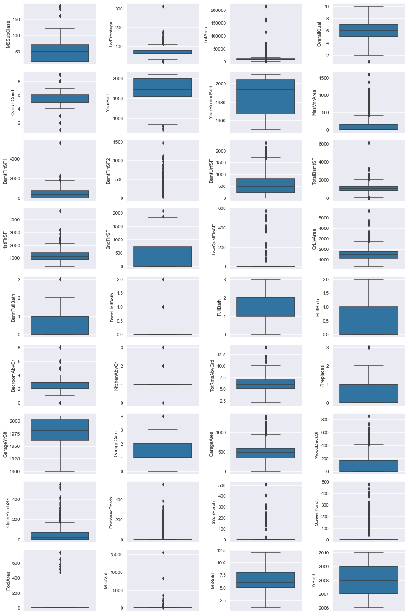


### 3.4 Bivariate Analysis

Next, we will expand the analysis by considering the relationship of every numerical feature with the house price.


```python
fig = plt.figure(figsize=(12,18))
for i in range(len(numerical_features.columns)):
    fig.add_subplot(9, 4, i+1)
    sns.scatterplot(numerical_features.iloc[:, i],train_data['SalePrice'])
plt.tight_layout()
plt.show()
```


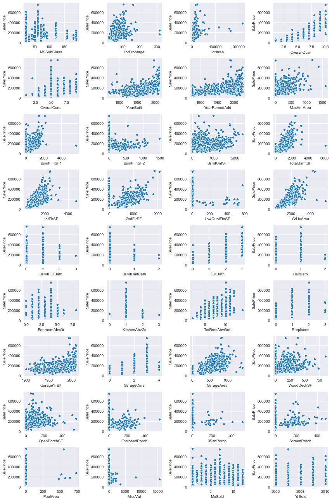


```python
train_data.info()
```

    <class 'pandas.core.frame.DataFrame'>
    Int64Index: 1449 entries, 1 to 1460
    Data columns (total 76 columns):
     #   Column         Non-Null Count  Dtype  
    ---  ------         --------------  -----  
     0   MSSubClass     1449 non-null   int64  
     1   MSZoning       1449 non-null   object 
     2   LotFrontage    1449 non-null   float64
     3   LotArea        1449 non-null   int64  
     4   Street         1449 non-null   object 
     5   LotShape       1449 non-null   object 
     6   LandContour    1449 non-null   object 
     7   Utilities      1449 non-null   object 
     8   LotConfig      1449 non-null   object 
     9   LandSlope      1449 non-null   object 
     10  Neighborhood   1449 non-null   object 
     11  Condition1     1449 non-null   object 
     12  Condition2     1449 non-null   object 
     13  BldgType       1449 non-null   object 
     14  HouseStyle     1449 non-null   object 
     15  OverallQual    1449 non-null   int64  
     16  OverallCond    1449 non-null   int64  
     17  YearBuilt      1449 non-null   int64  
     18  YearRemodAdd   1449 non-null   int64  
     19  RoofStyle      1449 non-null   object 
     20  RoofMatl       1449 non-null   object 
     21  Exterior1st    1449 non-null   object 
     22  Exterior2nd    1449 non-null   object 
     23  MasVnrType     1449 non-null   object 
     24  MasVnrArea     1449 non-null   float64
     25  ExterQual      1449 non-null   object 
     26  ExterCond      1449 non-null   object 
     27  Foundation     1449 non-null   object 
     28  BsmtQual       1449 non-null   object 
     29  BsmtCond       1449 non-null   object 
     30  BsmtExposure   1449 non-null   object 
     31  BsmtFinType1   1449 non-null   object 
     32  BsmtFinSF1     1449 non-null   int64  
     33  BsmtFinType2   1449 non-null   object 
     34  BsmtFinSF2     1449 non-null   int64  
     35  BsmtUnfSF      1449 non-null   int64  
     36  TotalBsmtSF    1449 non-null   int64  
     37  Heating        1449 non-null   object 
     38  HeatingQC      1449 non-null   object 
     39  CentralAir     1449 non-null   object 
     40  Electrical     1449 non-null   object 
     41  2ndFlrSF       1449 non-null   int64  
     42  LowQualFinSF   1449 non-null   int64  
     43  GrLivArea      1449 non-null   int64  
     44  BsmtFullBath   1449 non-null   int64  
     45  BsmtHalfBath   1449 non-null   int64  
     46  FullBath       1449 non-null   int64  
     47  HalfBath       1449 non-null   int64  
     48  BedroomAbvGr   1449 non-null   int64  
     49  KitchenAbvGr   1449 non-null   int64  
     50  KitchenQual    1449 non-null   object 
     51  Functional     1449 non-null   object 
     52  Fireplaces     1449 non-null   int64  
     53  FireplaceQu    1449 non-null   object 
     54  GarageType     1449 non-null   object 
     55  GarageFinish   1449 non-null   object 
     56  GarageCars     1449 non-null   int64  
     57  GarageQual     1449 non-null   object 
     58  GarageCond     1449 non-null   object 
     59  PavedDrive     1449 non-null   object 
     60  WoodDeckSF     1449 non-null   int64  
     61  OpenPorchSF    1449 non-null   int64  
     62  EnclosedPorch  1449 non-null   int64  
     63  3SsnPorch      1449 non-null   int64  
     64  ScreenPorch    1449 non-null   int64  
     65  Fence          1449 non-null   object 
     66  MiscVal        1449 non-null   int64  
     67  MoSold         1449 non-null   object 
     68  YrSold         1449 non-null   object 
     69  SaleType       1449 non-null   object 
     70  SaleCondition  1449 non-null   object 
     71  SalePrice      1449 non-null   int64  
     72  Has2ndfloor    1449 non-null   int64  
     73  HasBsmt        1449 non-null   int64  
     74  HasFirePlace   1449 non-null   int64  
     75  Has2ndFlr      1449 non-null   int64  
    dtypes: float64(2), int64(32), object(42)
    memory usage: 911.7+ KB
    


```python
train_data.columns
```


    Index(['MSSubClass', 'MSZoning', 'LotFrontage', 'LotArea', 'Street',
           'LotShape', 'LandContour', 'Utilities', 'LotConfig', 'LandSlope',
           'Neighborhood', 'Condition1', 'Condition2', 'BldgType', 'HouseStyle',
           'OverallQual', 'OverallCond', 'YearBuilt', 'YearRemodAdd', 'RoofStyle',
           'RoofMatl', 'Exterior1st', 'Exterior2nd', 'MasVnrType', 'MasVnrArea',
           'ExterQual', 'ExterCond', 'Foundation', 'BsmtQual', 'BsmtCond',
           'BsmtExposure', 'BsmtFinType1', 'BsmtFinSF1', 'BsmtFinType2',
           'BsmtFinSF2', 'BsmtUnfSF', 'TotalBsmtSF', 'Heating', 'HeatingQC',
           'CentralAir', 'Electrical', '2ndFlrSF', 'LowQualFinSF', 'GrLivArea',
           'BsmtFullBath', 'BsmtHalfBath', 'FullBath', 'HalfBath', 'BedroomAbvGr',
           'KitchenAbvGr', 'KitchenQual', 'Functional', 'Fireplaces',
           'FireplaceQu', 'GarageType', 'GarageFinish', 'GarageCars', 'GarageQual',
           'GarageCond', 'PavedDrive', 'WoodDeckSF', 'OpenPorchSF',
           'EnclosedPorch', '3SsnPorch', 'ScreenPorch', 'Fence', 'MiscVal',
           'MoSold', 'YrSold', 'SaleType', 'SaleCondition', 'SalePrice',
           'Has2ndfloor', 'HasBsmt', 'HasFirePlace', 'Has2ndFlr'],
          dtype='object')


## 4. Data Processing

In this section we will identify the outliers in the data, remove certain highly correlated features and fill missing values in numerical and categorical features appropriately.

- 4.1 Outliers
- 4.2 Removing Certain Features
- 4.3 Filling Numerical Missing Values
- 4.4 Filling Categorical Missing Values

### 4.1 Outliers

According to the plots above, these are the features which appear to have outliers:

- LotFrontage
- LotArea
- MasVnrArea
- BsmtFinSF1
- TotalBsmtSF
- 1stFlrSF
- EnclosedPorch
- MiscVal

Let's take a closer look at these features.


```python
figure, ((ax1, ax2), (ax3, ax4), (ax5, ax6), (ax7, ax8)) = plt.subplots(nrows=4, ncols=2)
figure.set_size_inches(16,28)
_ = sns.regplot(train_data['LotFrontage'], train_data['SalePrice'], ax=ax1)
_ = sns.regplot(train_data['LotArea'], train_data['SalePrice'], ax=ax2)
_ = sns.regplot(train_data['MasVnrArea'], train_data['SalePrice'], ax=ax3)
_ = sns.regplot(train_data['BsmtFinSF1'], train_data['SalePrice'], ax=ax4)
_ = sns.regplot(train_data['TotalBsmtSF'], train_data['SalePrice'], ax=ax5)
_ = sns.regplot(train_data['1stFlrSF'], train_data['SalePrice'], ax=ax6)
_ = sns.regplot(train_data['EnclosedPorch'], train_data['SalePrice'], ax=ax7)
_ = sns.regplot(train_data['MiscVal'], train_data['SalePrice'], ax=ax8)
```


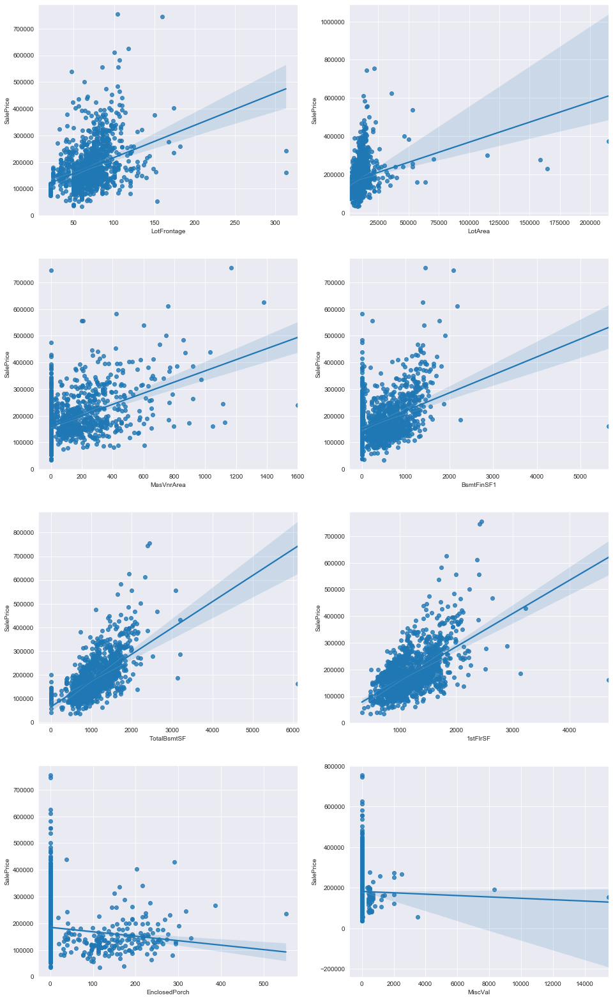


For example, in `EnclosedPorch` column there is an outlier with value larger than 500 and compared to other 1000+ values this point looks a bit off. Eliminating such outliers will help us to generalize our model and avoid overfitting in prediction.

So we will continue by filtering the data as described below:


```python
train_data = train_data.drop(train_data[train_data['LotFrontage']>200].index)
train_data = train_data.drop(train_data[train_data['LotArea']>100000].index)
train_data = train_data.drop(train_data[train_data['MasVnrArea']>1200].index)
train_data = train_data.drop(train_data[train_data['BsmtFinSF1']>4000].index)
train_data = train_data.drop(train_data[train_data['TotalBsmtSF']>4000].index)
train_data = train_data.drop(train_data[train_data['1stFlrSF']>4000].index)
train_data = train_data.drop(train_data[train_data['EnclosedPorch']>500].index)
train_data = train_data.drop(train_data[train_data['MiscVal']>5000].index)
```

### 4.2 Removing Certain Features

Next, we will find higly correlated features and remove one feature in every couple.
This will help us reduce their overfitting effect in our model.


```python
num_correlation = train_data.select_dtypes(exclude='object').corr()
plt.figure(figsize=(20,20))
plt.title('High Correlation')
sns.heatmap(num_correlation > 0.8, annot=True, square=True)
```


    <matplotlib.axes._subplots.AxesSubplot at 0x13bf540fac8>


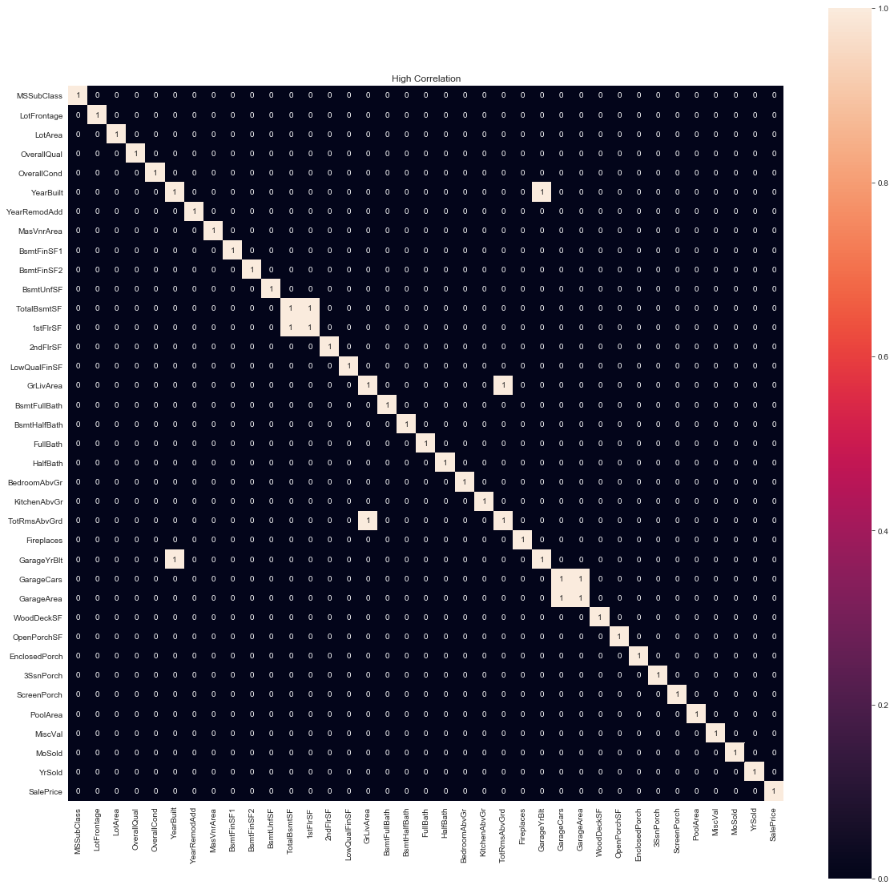


The heatmap above displays a boolean table for every feature couple and puts `1` (True) if that couple has a correlation of 0.8 or higher. The points excluding the diagonal `1` are our main concern here.

According to this heatmap, highly correlated features are below:
- YearBuilt vs GarageYrBlt
- 1stFlrSF vs TotalBsmtSF
- GrLivArea vs TotRmsAbvGrd
- GarageCars vs GarageArea

And below list shows the correlation of every feature with `SalePrice`, the price of the houses.


```python
corr = num_correlation.corr()
print(corr['SalePrice'].sort_values(ascending=False))
```

    SalePrice        1.000000
    OverallQual      0.957368
    GarageCars       0.904585
    GarageArea       0.897669
    TotalBsmtSF      0.825906
    1stFlrSF         0.805062
    GrLivArea        0.800791
    FullBath         0.799044
    MasVnrArea       0.795108
    YearBuilt        0.785410
    YearRemodAdd     0.755665
    GarageYrBlt      0.753504
    Fireplaces       0.720128
    TotRmsAbvGrd     0.623028
    LotFrontage      0.605839
    OpenPorchSF      0.592191
    WoodDeckSF       0.569842
    LotArea          0.534966
    BsmtFinSF1       0.499652
    BsmtUnfSF        0.444518
    HalfBath         0.391875
    BsmtFullBath     0.272316
    2ndFlrSF         0.256162
    BedroomAbvGr     0.179484
    ScreenPorch      0.014134
    PoolArea        -0.016212
    MoSold          -0.024352
    3SsnPorch       -0.044218
    YrSold          -0.220889
    BsmtFinSF2      -0.225291
    BsmtHalfBath    -0.239809
    LowQualFinSF    -0.261396
    MSSubClass      -0.279430
    MiscVal         -0.349252
    KitchenAbvGr    -0.369341
    OverallCond     -0.478252
    EnclosedPorch   -0.481796
    Name: SalePrice, dtype: float64
    

Now we will remove one of the highly correlated feature couples:


```python
train_data.drop(columns=['GarageArea','TotRmsAbvGrd','GarageYrBlt','1stFlrSF'],axis=1,inplace=True) 
test_data.drop(columns=['GarageArea','TotRmsAbvGrd','GarageYrBlt','1stFlrSF'],axis=1,inplace=True)
```

Let's see which features have the most missing values:


```python
train_data.isnull().mean().sort_values(ascending=False).head(10)
```


    PoolQC          0.996549
    MiscFeature     0.965493
    Alley           0.937888
    Fence           0.806763
    FireplaceQu     0.475500
    LotFrontage     0.175293
    GarageCond      0.055901
    GarageType      0.055901
    GarageFinish    0.055901
    GarageQual      0.055901
    dtype: float64


It is clear that the features `Alley`, `MiscFeature` and `PoolQC` are missing over 90% of their values. I decided to remove those features rather than filling them. Once we remove `PoolQC` feature, `PoolArea` becomes useless so we also drop this feature.


```python
train_data.drop(columns=['Alley','MiscFeature','PoolQC','PoolArea'], axis=1, inplace=True)
test_data.drop(columns=['Alley','MiscFeature','PoolQC','PoolArea'], axis=1, inplace=True)
```


```python
test_data.isnull().mean().sort_values(ascending=False).head(10)
```


    Fence           0.801234
    FireplaceQu     0.500343
    LotFrontage     0.155586
    GarageCond      0.053461
    GarageQual      0.053461
    GarageFinish    0.053461
    GarageType      0.052090
    BsmtCond        0.030843
    BsmtQual        0.030158
    BsmtExposure    0.030158
    dtype: float64


Test data doesn't have any features that have over 90% of missing values. So we don't drop any features here.

### 4.3 Filling Numerical Missing Values

So far we filtered out the features with high missing values and high correlation. Now we will fill the missing values in features we have. Let's start with looking the percentage of missing values in each feature.


```python
# Checking Train and Test data missing value percentage
null = pd.DataFrame(data={'Train Data Null Percentage': train_data.isnull().sum()[train_data.isnull().sum() > 0], 'Test Data Null Percentage': test_data.isnull().sum()[test_data.isnull().sum() > 0]})
null = round(((null/len(train_data)) * 100), 2)

null.index.name='Feature'
null
```


<div>
<style scoped>
    .dataframe tbody tr th:only-of-type {
        vertical-align: middle;
    }

    .dataframe tbody tr th {
        vertical-align: top;
    }

    .dataframe thead th {
        text-align: right;
    }
</style>
<table border="1" class="dataframe">
  <thead>
    <tr style="text-align: right;">
      <th></th>
      <th>Train Data Null Percentage</th>
      <th>Test Data Null Percentage</th>
    </tr>
    <tr>
      <th>Feature</th>
      <th></th>
      <th></th>
    </tr>
  </thead>
  <tbody>
    <tr>
      <th>BsmtCond</th>
      <td>2.55</td>
      <td>3.11</td>
    </tr>
    <tr>
      <th>BsmtExposure</th>
      <td>2.62</td>
      <td>3.04</td>
    </tr>
    <tr>
      <th>BsmtFinSF1</th>
      <td>NaN</td>
      <td>0.07</td>
    </tr>
    <tr>
      <th>BsmtFinSF2</th>
      <td>NaN</td>
      <td>0.07</td>
    </tr>
    <tr>
      <th>BsmtFinType1</th>
      <td>2.55</td>
      <td>2.90</td>
    </tr>
    <tr>
      <th>BsmtFinType2</th>
      <td>2.62</td>
      <td>2.90</td>
    </tr>
    <tr>
      <th>BsmtFullBath</th>
      <td>NaN</td>
      <td>0.14</td>
    </tr>
    <tr>
      <th>BsmtHalfBath</th>
      <td>NaN</td>
      <td>0.14</td>
    </tr>
    <tr>
      <th>BsmtQual</th>
      <td>2.55</td>
      <td>3.04</td>
    </tr>
    <tr>
      <th>BsmtUnfSF</th>
      <td>NaN</td>
      <td>0.07</td>
    </tr>
    <tr>
      <th>Electrical</th>
      <td>0.07</td>
      <td>NaN</td>
    </tr>
    <tr>
      <th>Exterior1st</th>
      <td>NaN</td>
      <td>0.07</td>
    </tr>
    <tr>
      <th>Exterior2nd</th>
      <td>NaN</td>
      <td>0.07</td>
    </tr>
    <tr>
      <th>Fence</th>
      <td>80.68</td>
      <td>80.68</td>
    </tr>
    <tr>
      <th>FireplaceQu</th>
      <td>47.55</td>
      <td>50.38</td>
    </tr>
    <tr>
      <th>Functional</th>
      <td>NaN</td>
      <td>0.14</td>
    </tr>
    <tr>
      <th>GarageCars</th>
      <td>NaN</td>
      <td>0.07</td>
    </tr>
    <tr>
      <th>GarageCond</th>
      <td>5.59</td>
      <td>5.38</td>
    </tr>
    <tr>
      <th>GarageFinish</th>
      <td>5.59</td>
      <td>5.38</td>
    </tr>
    <tr>
      <th>GarageQual</th>
      <td>5.59</td>
      <td>5.38</td>
    </tr>
    <tr>
      <th>GarageType</th>
      <td>5.59</td>
      <td>5.24</td>
    </tr>
    <tr>
      <th>KitchenQual</th>
      <td>NaN</td>
      <td>0.07</td>
    </tr>
    <tr>
      <th>LotFrontage</th>
      <td>17.53</td>
      <td>15.67</td>
    </tr>
    <tr>
      <th>MSZoning</th>
      <td>NaN</td>
      <td>0.28</td>
    </tr>
    <tr>
      <th>MasVnrArea</th>
      <td>0.55</td>
      <td>1.04</td>
    </tr>
    <tr>
      <th>MasVnrType</th>
      <td>0.55</td>
      <td>1.10</td>
    </tr>
    <tr>
      <th>SaleType</th>
      <td>NaN</td>
      <td>0.07</td>
    </tr>
    <tr>
      <th>TotalBsmtSF</th>
      <td>NaN</td>
      <td>0.07</td>
    </tr>
    <tr>
      <th>Utilities</th>
      <td>NaN</td>
      <td>0.14</td>
    </tr>
  </tbody>
</table>
</div>


```python
## Number of rows with missing values for each column
train_data.isnull().sum().sort_values(ascending=False)[:20]
```


    Fence           1169
    FireplaceQu      689
    LotFrontage      254
    GarageCond        81
    GarageType        81
    GarageFinish      81
    GarageQual        81
    BsmtExposure      38
    BsmtFinType2      38
    BsmtCond          37
    BsmtQual          37
    BsmtFinType1      37
    MasVnrType         8
    MasVnrArea         8
    Electrical         1
    YearBuilt          0
    Exterior2nd        0
    ExterQual          0
    ExterCond          0
    Exterior1st        0
    dtype: int64


```python
##Filtering numerical features with missing value percentage

train_num_features = train_data.select_dtypes(exclude='object').isnull().mean()
test_num_features = test_data.select_dtypes(exclude='object').isnull().mean()

num_null_features = pd.DataFrame(data={'Missing Num in Train Data, Percentage: ': train_num_features[train_num_features > 0], 
                                       'Missing Num in Test Data, Percentage: ': test_num_features[test_num_features > 0]
                                      })

num_null_features.index.name = 'Numerical Features'
num_null_features
```


<div>
<style scoped>
    .dataframe tbody tr th:only-of-type {
        vertical-align: middle;
    }

    .dataframe tbody tr th {
        vertical-align: top;
    }

    .dataframe thead th {
        text-align: right;
    }
</style>
<table border="1" class="dataframe">
  <thead>
    <tr style="text-align: right;">
      <th></th>
      <th>Missing Num in Train Data, Percentage:</th>
      <th>Missing Num in Test Data, Percentage:</th>
    </tr>
    <tr>
      <th>Numerical Features</th>
      <th></th>
      <th></th>
    </tr>
  </thead>
  <tbody>
    <tr>
      <th>BsmtFinSF1</th>
      <td>NaN</td>
      <td>0.000685</td>
    </tr>
    <tr>
      <th>BsmtFinSF2</th>
      <td>NaN</td>
      <td>0.000685</td>
    </tr>
    <tr>
      <th>BsmtFullBath</th>
      <td>NaN</td>
      <td>0.001371</td>
    </tr>
    <tr>
      <th>BsmtHalfBath</th>
      <td>NaN</td>
      <td>0.001371</td>
    </tr>
    <tr>
      <th>BsmtUnfSF</th>
      <td>NaN</td>
      <td>0.000685</td>
    </tr>
    <tr>
      <th>GarageCars</th>
      <td>NaN</td>
      <td>0.000685</td>
    </tr>
    <tr>
      <th>LotFrontage</th>
      <td>0.175293</td>
      <td>0.155586</td>
    </tr>
    <tr>
      <th>MasVnrArea</th>
      <td>0.005521</td>
      <td>0.010281</td>
    </tr>
    <tr>
      <th>TotalBsmtSF</th>
      <td>NaN</td>
      <td>0.000685</td>
    </tr>
  </tbody>
</table>
</div>


```python
## Fill missing values in numerical features with "0", excluding 'LotFrontage'
for df in [train_data, test_data]:
    for col in ('BsmtFinSF1', 'BsmtFinSF2', 'BsmtFullBath', 'BsmtHalfBath', 'BsmtUnfSF', 
                'GarageCars', 'LowQualFinSF', 'GrLivArea', 'MasVnrArea', 'TotalBsmtSF'):
                    df[col] = df[col].fillna(0)
```


```python
_=sns.regplot(train_data['LotFrontage'],train_data['SalePrice'])
```


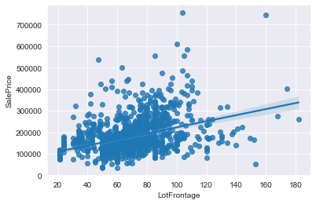


```python
train_num_features = train_data.select_dtypes(exclude='object').isnull().mean()
test_num_features = test_data.select_dtypes(exclude='object').isnull().mean()

num_null_features = pd.DataFrame(data={'Missing Num in Train Data, Percentage: ': train_num_features[train_num_features > 0], 
                                       'Missing Num in Test Data, Percentage: ': test_num_features[test_num_features > 0]})
num_null_features.index.name = 'Numerical Features'
num_null_features
```


<div>
<style scoped>
    .dataframe tbody tr th:only-of-type {
        vertical-align: middle;
    }

    .dataframe tbody tr th {
        vertical-align: top;
    }

    .dataframe thead th {
        text-align: right;
    }
</style>
<table border="1" class="dataframe">
  <thead>
    <tr style="text-align: right;">
      <th></th>
      <th>Missing Num in Train Data, Percentage:</th>
      <th>Missing Num in Test Data, Percentage:</th>
    </tr>
    <tr>
      <th>Numerical Features</th>
      <th></th>
      <th></th>
    </tr>
  </thead>
  <tbody>
    <tr>
      <th>LotFrontage</th>
      <td>0.175293</td>
      <td>0.155586</td>
    </tr>
  </tbody>
</table>
</div>


We will fill missing 'LotFrontage' values by considering Neighborhood information. Let's use median of the values accordingly.


```python
train_data['LotFrontage'] = train_data.groupby('Neighborhood')['LotFrontage'].apply(lambda x: x.fillna(x.median()))
test_data['LotFrontage'] = test_data.groupby('Neighborhood')['LotFrontage'].apply(lambda x: x.fillna(x.median()))
```

### 4.4 Filling Categorical Missing Values

Let's examine categorical features of these datasets.


```python
## Identifying categorical features
cat_col = train_data.select_dtypes(include='object').columns
print(cat_col)
```

    Index(['MSZoning', 'Street', 'LotShape', 'LandContour', 'Utilities',
           'LotConfig', 'LandSlope', 'Neighborhood', 'Condition1', 'Condition2',
           'BldgType', 'HouseStyle', 'RoofStyle', 'RoofMatl', 'Exterior1st',
           'Exterior2nd', 'MasVnrType', 'ExterQual', 'ExterCond', 'Foundation',
           'BsmtQual', 'BsmtCond', 'BsmtExposure', 'BsmtFinType1', 'BsmtFinType2',
           'Heating', 'HeatingQC', 'CentralAir', 'Electrical', 'KitchenQual',
           'Functional', 'FireplaceQu', 'GarageType', 'GarageFinish', 'GarageQual',
           'GarageCond', 'PavedDrive', 'Fence', 'SaleType', 'SaleCondition'],
          dtype='object')
    


```python
##Filtering categorical features with missing value percentage
train_cat_features = train_data.select_dtypes(include='object').isnull().mean()
test_cat_features = test_data.select_dtypes(include='object').isnull().mean()

cat_null_features = pd.DataFrame(data={'Missing Cat in Train Data, Percentage: ': train_cat_features[train_cat_features > 0], 
                                       'Missing Cat in Test Data, Percentage: ': test_cat_features[test_cat_features > 0]})
cat_null_features.index.name = 'Categorical Features'
cat_null_features
```


<div>
<style scoped>
    .dataframe tbody tr th:only-of-type {
        vertical-align: middle;
    }

    .dataframe tbody tr th {
        vertical-align: top;
    }

    .dataframe thead th {
        text-align: right;
    }
</style>
<table border="1" class="dataframe">
  <thead>
    <tr style="text-align: right;">
      <th></th>
      <th>Missing Cat in Train Data, Percentage:</th>
      <th>Missing Cat in Test Data, Percentage:</th>
    </tr>
    <tr>
      <th>Categorical Features</th>
      <th></th>
      <th></th>
    </tr>
  </thead>
  <tbody>
    <tr>
      <th>BsmtCond</th>
      <td>0.025535</td>
      <td>0.030843</td>
    </tr>
    <tr>
      <th>BsmtExposure</th>
      <td>0.026225</td>
      <td>0.030158</td>
    </tr>
    <tr>
      <th>BsmtFinType1</th>
      <td>0.025535</td>
      <td>0.028787</td>
    </tr>
    <tr>
      <th>BsmtFinType2</th>
      <td>0.026225</td>
      <td>0.028787</td>
    </tr>
    <tr>
      <th>BsmtQual</th>
      <td>0.025535</td>
      <td>0.030158</td>
    </tr>
    <tr>
      <th>Electrical</th>
      <td>0.000690</td>
      <td>NaN</td>
    </tr>
    <tr>
      <th>Exterior1st</th>
      <td>NaN</td>
      <td>0.000685</td>
    </tr>
    <tr>
      <th>Exterior2nd</th>
      <td>NaN</td>
      <td>0.000685</td>
    </tr>
    <tr>
      <th>Fence</th>
      <td>0.806763</td>
      <td>0.801234</td>
    </tr>
    <tr>
      <th>FireplaceQu</th>
      <td>0.475500</td>
      <td>0.500343</td>
    </tr>
    <tr>
      <th>Functional</th>
      <td>NaN</td>
      <td>0.001371</td>
    </tr>
    <tr>
      <th>GarageCond</th>
      <td>0.055901</td>
      <td>0.053461</td>
    </tr>
    <tr>
      <th>GarageFinish</th>
      <td>0.055901</td>
      <td>0.053461</td>
    </tr>
    <tr>
      <th>GarageQual</th>
      <td>0.055901</td>
      <td>0.053461</td>
    </tr>
    <tr>
      <th>GarageType</th>
      <td>0.055901</td>
      <td>0.052090</td>
    </tr>
    <tr>
      <th>KitchenQual</th>
      <td>NaN</td>
      <td>0.000685</td>
    </tr>
    <tr>
      <th>MSZoning</th>
      <td>NaN</td>
      <td>0.002742</td>
    </tr>
    <tr>
      <th>MasVnrType</th>
      <td>0.005521</td>
      <td>0.010966</td>
    </tr>
    <tr>
      <th>SaleType</th>
      <td>NaN</td>
      <td>0.000685</td>
    </tr>
    <tr>
      <th>Utilities</th>
      <td>NaN</td>
      <td>0.001371</td>
    </tr>
  </tbody>
</table>
</div>


```python
## Visualize every categorical feature with their values

cat_col = train_data.select_dtypes(include='object').columns

columns = len(cat_col)/4+1

fg, ax = plt.subplots(figsize=(15, 30))

for i, col in enumerate(cat_col):
    fg.add_subplot(columns, 4, i+1)
    sns.countplot(train_data[col])
    plt.xlabel(col)
    plt.xticks(rotation=90)

plt.tight_layout()
plt.show()
```


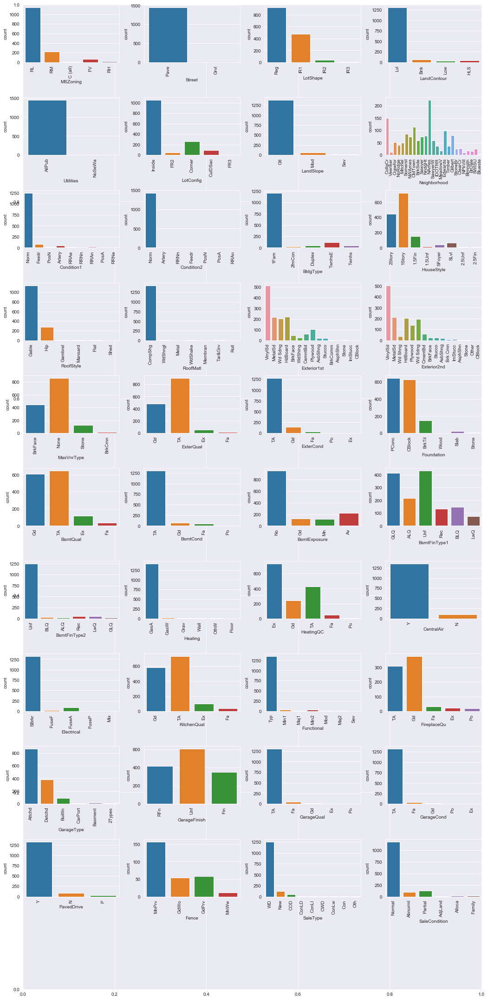


```python
## Visualize 'KitchenQual' and 'SalePrice' relationship in boxplot
var = train_data['KitchenQual']
f, ax = plt.subplots(figsize=(10,6))
sns.boxplot(y=train_data.SalePrice, x=var)
plt.show()
```


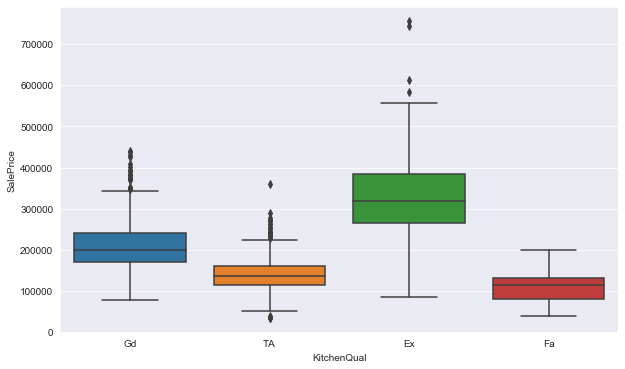


```python
## Visualize Neighborhood effect on SalePrice

f, ax = plt.subplots(figsize=(12,8))
sns.boxplot(y=train_data.SalePrice, x=train_data.Neighborhood)
plt.xticks(rotation=45)
plt.show()
```


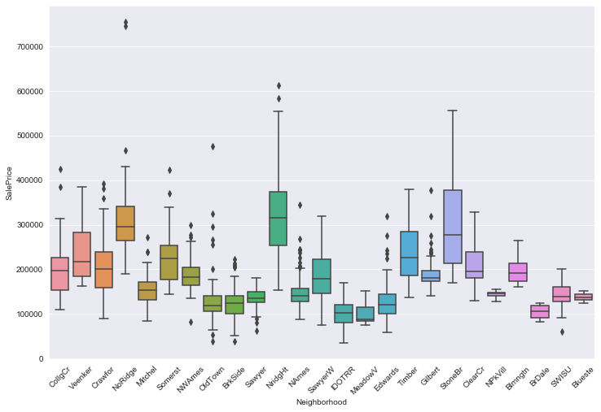


```python
## Count of categories within Neighborhood attribute
fig = plt.figure(figsize=(12.5,4))
sns.countplot(x='Neighborhood', data=train_data)
plt.xticks(rotation=90)
plt.ylabel('Frequency')
plt.show()
```


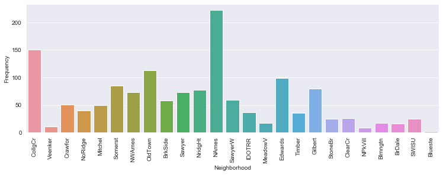


```python
train_data.select_dtypes(include=['object']).columns
```


    Index(['MSZoning', 'Street', 'LotShape', 'LandContour', 'Utilities',
           'LotConfig', 'LandSlope', 'Neighborhood', 'Condition1', 'Condition2',
           'BldgType', 'HouseStyle', 'RoofStyle', 'RoofMatl', 'Exterior1st',
           'Exterior2nd', 'MasVnrType', 'ExterQual', 'ExterCond', 'Foundation',
           'BsmtQual', 'BsmtCond', 'BsmtExposure', 'BsmtFinType1', 'BsmtFinType2',
           'Heating', 'HeatingQC', 'CentralAir', 'Electrical', 'KitchenQual',
           'Functional', 'FireplaceQu', 'GarageType', 'GarageFinish', 'GarageQual',
           'GarageCond', 'PavedDrive', 'Fence', 'SaleType', 'SaleCondition'],
          dtype='object')


```python
train_cat_features = train_data.select_dtypes(include='object').isnull().mean()
test_cat_features = test_data.select_dtypes(include='object').isnull().mean()

cat_null_features = pd.DataFrame(data={'Missing Cat Train Data Percentage': train_cat_features[train_cat_features > 0], 
                                       'Missing Cat Test Data Percentage': test_cat_features[test_cat_features > 0]})
cat_null_features.index.name = 'Categorical Features'
cat_null_features.sort_values('Missing Cat Train Data Percentage', ascending=False)
```


<div>
<style scoped>
    .dataframe tbody tr th:only-of-type {
        vertical-align: middle;
    }

    .dataframe tbody tr th {
        vertical-align: top;
    }

    .dataframe thead th {
        text-align: right;
    }
</style>
<table border="1" class="dataframe">
  <thead>
    <tr style="text-align: right;">
      <th></th>
      <th>Missing Cat Train Data Percentage</th>
      <th>Missing Cat Test Data Percentage</th>
    </tr>
    <tr>
      <th>Categorical Features</th>
      <th></th>
      <th></th>
    </tr>
  </thead>
  <tbody>
    <tr>
      <th>Fence</th>
      <td>0.806763</td>
      <td>0.801234</td>
    </tr>
    <tr>
      <th>FireplaceQu</th>
      <td>0.475500</td>
      <td>0.500343</td>
    </tr>
    <tr>
      <th>GarageCond</th>
      <td>0.055901</td>
      <td>0.053461</td>
    </tr>
    <tr>
      <th>GarageFinish</th>
      <td>0.055901</td>
      <td>0.053461</td>
    </tr>
    <tr>
      <th>GarageQual</th>
      <td>0.055901</td>
      <td>0.053461</td>
    </tr>
    <tr>
      <th>GarageType</th>
      <td>0.055901</td>
      <td>0.052090</td>
    </tr>
    <tr>
      <th>BsmtExposure</th>
      <td>0.026225</td>
      <td>0.030158</td>
    </tr>
    <tr>
      <th>BsmtFinType2</th>
      <td>0.026225</td>
      <td>0.028787</td>
    </tr>
    <tr>
      <th>BsmtCond</th>
      <td>0.025535</td>
      <td>0.030843</td>
    </tr>
    <tr>
      <th>BsmtFinType1</th>
      <td>0.025535</td>
      <td>0.028787</td>
    </tr>
    <tr>
      <th>BsmtQual</th>
      <td>0.025535</td>
      <td>0.030158</td>
    </tr>
    <tr>
      <th>MasVnrType</th>
      <td>0.005521</td>
      <td>0.010966</td>
    </tr>
    <tr>
      <th>Electrical</th>
      <td>0.000690</td>
      <td>NaN</td>
    </tr>
    <tr>
      <th>Exterior1st</th>
      <td>NaN</td>
      <td>0.000685</td>
    </tr>
    <tr>
      <th>Exterior2nd</th>
      <td>NaN</td>
      <td>0.000685</td>
    </tr>
    <tr>
      <th>Functional</th>
      <td>NaN</td>
      <td>0.001371</td>
    </tr>
    <tr>
      <th>KitchenQual</th>
      <td>NaN</td>
      <td>0.000685</td>
    </tr>
    <tr>
      <th>MSZoning</th>
      <td>NaN</td>
      <td>0.002742</td>
    </tr>
    <tr>
      <th>SaleType</th>
      <td>NaN</td>
      <td>0.000685</td>
    </tr>
    <tr>
      <th>Utilities</th>
      <td>NaN</td>
      <td>0.001371</td>
    </tr>
  </tbody>
</table>
</div>


```python
cat_null_features.index
```


    Index(['BsmtCond', 'BsmtExposure', 'BsmtFinType1', 'BsmtFinType2', 'BsmtQual',
           'Electrical', 'Exterior1st', 'Exterior2nd', 'Fence', 'FireplaceQu',
           'Functional', 'GarageCond', 'GarageFinish', 'GarageQual', 'GarageType',
           'KitchenQual', 'MSZoning', 'MasVnrType', 'SaleType', 'Utilities'],
          dtype='object', name='Categorical Features')


```python
# Fill null values in columns with missing values
for df in [train_data, test_data]:
    for col in ('BsmtCond', 'BsmtExposure', 'BsmtFinType1', 'BsmtFinType2', 'BsmtQual',
       'Electrical', 'Exterior1st', 'Exterior2nd', 'Fence', 'FireplaceQu',
       'Functional', 'GarageCond', 'GarageFinish', 'GarageQual', 'GarageType',
       'KitchenQual', 'MSZoning', 'MasVnrType', 'SaleType', 'Utilities'):
        df[col] = df[col].fillna('None')
```


```python
train_cat_features = train_data.select_dtypes(include='object').isnull().mean()
test_cat_features = test_data.select_dtypes(include='object').isnull().mean()

cat_null_features = pd.DataFrame(data={'Missing Cat Train Data Percentage': train_cat_features[train_cat_features > 0], 
                                       'Missing Cat Test Data Percentage': test_cat_features[test_cat_features > 0]})
cat_null_features.index.name = 'Categorical Features'
cat_null_features.sort_values('Missing Cat Train Data Percentage', ascending=False)
```


<div>
<style scoped>
    .dataframe tbody tr th:only-of-type {
        vertical-align: middle;
    }

    .dataframe tbody tr th {
        vertical-align: top;
    }

    .dataframe thead th {
        text-align: right;
    }
</style>
<table border="1" class="dataframe">
  <thead>
    <tr style="text-align: right;">
      <th></th>
      <th>Missing Cat Train Data Percentage</th>
      <th>Missing Cat Test Data Percentage</th>
    </tr>
    <tr>
      <th>Categorical Features</th>
      <th></th>
      <th></th>
    </tr>
  </thead>
  <tbody>
  </tbody>
</table>
</div>


There is no more missing values in categorical features.

## 5. Feature Engineering
In this section:

- 5.1 Creating extra features and changing types
- 5.2 SalePrice Distribution Visualization

### 5.1 Creating extra features and changing types

We create extra features in order to categorize data with and without a feature

For example:
- 'HasPool' is 1 if you have pool and 0 if you don't have a pool


```python
train_data['Has2ndfloor'] = train_data['2ndFlrSF'].apply(lambda x: 1 if x > 0 else 0)
train_data['HasBsmt'] = train_data['TotalBsmtSF'].apply(lambda x: 1 if x > 0 else 0)
train_data['HasFirePlace'] = train_data['Fireplaces'].apply(lambda x: 1 if x > 0 else 0)
train_data['Has2ndFlr'] = train_data['2ndFlrSF'].apply(lambda x: 1 if x > 0 else 0)
train_data['HasBsmt'] = train_data['TotalBsmtSF'].apply(lambda x: 1 if x > 0 else 0)

test_data['Has2ndfloor'] = test_data['2ndFlrSF'].apply(lambda x: 1 if x > 0 else 0)
test_data['HasBsmt'] = test_data['TotalBsmtSF'].apply(lambda x: 1 if x > 0 else 0)
test_data['HasFirePlace'] = test_data['Fireplaces'].apply(lambda x: 1 if x > 0 else 0)
test_data['Has2ndFlr'] = test_data['2ndFlrSF'].apply(lambda x: 1 if x > 0 else 0)
test_data['HasBsmt'] = test_data['TotalBsmtSF'].apply(lambda x: 1 if x > 0 else 0)
```

`MoSold` and `YrSold` columns are more intuitive if translated in categorical values rather than numerical values. So we will change the data types of these columns and later we will deal with them as categorical features.

`MSSubClass`, `OverallQual`, `OverallCond`, 
`HalfBath`, `BedroomAbvGr`, `KitchenAbvGr`, 
`Fireplaces`, `GarageCars`, `MoSold`, `YrSold` 


```python
train_data['MoSold'] = train_data['MoSold'].apply(str)
train_data['YrSold'] = train_data['YrSold'].apply(str)
train_data['YrSold'] = train_data['YrSold'].apply(str)
train_data['YrSold'] = train_data['YrSold'].apply(str)
train_data['YrSold'] = train_data['YrSold'].apply(str)
train_data['YrSold'] = train_data['YrSold'].apply(str)


test_data['MoSold'] = test_data['MoSold'].apply(str)
test_data['YrSold'] = test_data['YrSold'].apply(str)
test_data['MoSold'] = test_data['MoSold'].apply(str)

```


```python
train_data.info()
```

    <class 'pandas.core.frame.DataFrame'>
    Int64Index: 1449 entries, 1 to 1460
    Data columns (total 76 columns):
     #   Column         Non-Null Count  Dtype  
    ---  ------         --------------  -----  
     0   MSSubClass     1449 non-null   object 
     1   MSZoning       1449 non-null   object 
     2   LotFrontage    1449 non-null   float64
     3   LotArea        1449 non-null   int64  
     4   Street         1449 non-null   object 
     5   LotShape       1449 non-null   object 
     6   LandContour    1449 non-null   object 
     7   Utilities      1449 non-null   object 
     8   LotConfig      1449 non-null   object 
     9   LandSlope      1449 non-null   object 
     10  Neighborhood   1449 non-null   object 
     11  Condition1     1449 non-null   object 
     12  Condition2     1449 non-null   object 
     13  BldgType       1449 non-null   object 
     14  HouseStyle     1449 non-null   object 
     15  OverallQual    1449 non-null   object 
     16  OverallCond    1449 non-null   object 
     17  YearBuilt      1449 non-null   int64  
     18  YearRemodAdd   1449 non-null   int64  
     19  RoofStyle      1449 non-null   object 
     20  RoofMatl       1449 non-null   object 
     21  Exterior1st    1449 non-null   object 
     22  Exterior2nd    1449 non-null   object 
     23  MasVnrType     1449 non-null   object 
     24  MasVnrArea     1449 non-null   float64
     25  ExterQual      1449 non-null   object 
     26  ExterCond      1449 non-null   object 
     27  Foundation     1449 non-null   object 
     28  BsmtQual       1449 non-null   object 
     29  BsmtCond       1449 non-null   object 
     30  BsmtExposure   1449 non-null   object 
     31  BsmtFinType1   1449 non-null   object 
     32  BsmtFinSF1     1449 non-null   int64  
     33  BsmtFinType2   1449 non-null   object 
     34  BsmtFinSF2     1449 non-null   int64  
     35  BsmtUnfSF      1449 non-null   int64  
     36  TotalBsmtSF    1449 non-null   int64  
     37  Heating        1449 non-null   object 
     38  HeatingQC      1449 non-null   object 
     39  CentralAir     1449 non-null   object 
     40  Electrical     1449 non-null   object 
     41  2ndFlrSF       1449 non-null   int64  
     42  LowQualFinSF   1449 non-null   int64  
     43  GrLivArea      1449 non-null   int64  
     44  BsmtFullBath   1449 non-null   int64  
     45  BsmtHalfBath   1449 non-null   int64  
     46  FullBath       1449 non-null   int64  
     47  HalfBath       1449 non-null   object 
     48  BedroomAbvGr   1449 non-null   object 
     49  KitchenAbvGr   1449 non-null   object 
     50  KitchenQual    1449 non-null   object 
     51  Functional     1449 non-null   object 
     52  Fireplaces     1449 non-null   object 
     53  FireplaceQu    1449 non-null   object 
     54  GarageType     1449 non-null   object 
     55  GarageFinish   1449 non-null   object 
     56  GarageCars     1449 non-null   object 
     57  GarageQual     1449 non-null   object 
     58  GarageCond     1449 non-null   object 
     59  PavedDrive     1449 non-null   object 
     60  WoodDeckSF     1449 non-null   int64  
     61  OpenPorchSF    1449 non-null   int64  
     62  EnclosedPorch  1449 non-null   int64  
     63  3SsnPorch      1449 non-null   int64  
     64  ScreenPorch    1449 non-null   int64  
     65  Fence          1449 non-null   object 
     66  MiscVal        1449 non-null   int64  
     67  MoSold         1449 non-null   object 
     68  YrSold         1449 non-null   object 
     69  SaleType       1449 non-null   object 
     70  SaleCondition  1449 non-null   object 
     71  SalePrice      1449 non-null   int64  
     72  Has2ndfloor    1449 non-null   int64  
     73  HasBsmt        1449 non-null   int64  
     74  HasFirePlace   1449 non-null   int64  
     75  Has2ndFlr      1449 non-null   int64  
    dtypes: float64(2), int64(24), object(50)
    memory usage: 911.7+ KB
    


```python
for df in [train_data, test_data]:
    for col in ('MSSubClass', 'OverallQual', 'OverallCond',
                'HalfBath', 'BedroomAbvGr', 'KitchenAbvGr', 'Fireplaces', 'GarageCars', 'MoSold', 'YrSold'):
        df[col] = df[col].apply(str)
```

### 5.2 SalePrice Distribution Visualization


```python
fig = plt.figure(figsize=(11,11))

print ("Skew of SalePrice:", train_data.SalePrice.skew())
plt.hist(train_data.SalePrice, normed=1, color='red')
plt.show()
```

    Skew of SalePrice: 1.8496865159274047
    

    C:\Users\ylmza\Anaconda3\lib\site-packages\ipykernel_launcher.py:4: MatplotlibDeprecationWarning: 
    The 'normed' kwarg was deprecated in Matplotlib 2.1 and will be removed in 3.1. Use 'density' instead.
      after removing the cwd from sys.path.
    


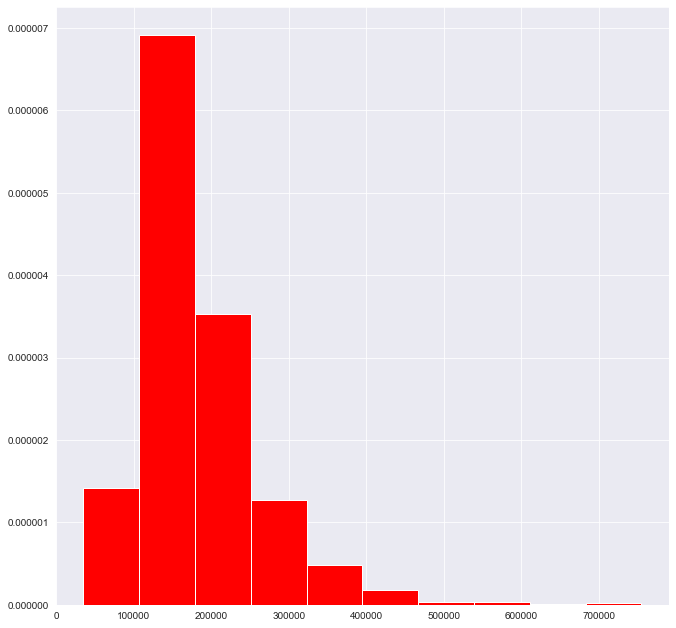


The graph shows that SalePrice is skewed to the right and must be modified


```python
fig = plt.figure(figsize=(11,11))

print ("Skew of Log-Transformed SalePrice:", np.log1p(train_data.SalePrice).skew())
plt.hist(np.log1p(train_data.SalePrice), color='green')
plt.show()
```

    Skew of Log-Transformed SalePrice: 0.11097465378779513
    


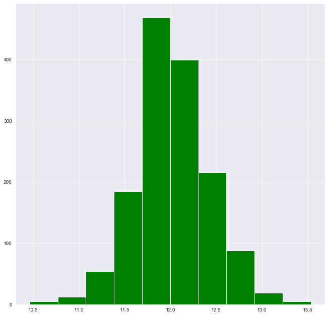


As we can see the skew improved from approximately 1.85 to approximately 0.11 so we will log-transform SalePrice in the next section

## 6. Modelling

This is the final section in our project. Here we will drop the price column in training data and split our training data to train the model accordingly. Then we will examine multiple models to find best model fitting our approach. Last step will be using final model to predict house prices on test data.  

In this section:

- 6.1 Dealing with Data for Modelling
- 6.2 Finding the Best Model
- 6.3 Setting up Final Model for Submission

### 6.1 Dealing with Data for Modelling

As a reminder, the predictions will be evaluated on Root-Mean-Squared-Error (RMSE) between the logarithm of the predicted value and the logarithm of the observed sales price. So we will log-transform the price values to align our model.


```python
## Drop price column and arrange price values 
X = train_data.drop(['SalePrice'], axis=1)
y = np.log1p(train_data['SalePrice'])
```


```python
X_train, X_valid, y_train, y_valid = train_test_split(X, y, test_size=0.2, train_size=0.8, random_state=123)
```

We select every numerical and categorical column from X.


```python
categorical_cols = [cname for cname in X.columns if
                    X[cname].dtype == "object"] 
                


numerical_cols = [cname for cname in X.columns if
                 X[cname].dtype in ['int64','float64']]


my_cols = numerical_cols + categorical_cols

X_train = X_train[my_cols].copy()
X_valid = X_valid[my_cols].copy()
X_test = test_data[my_cols].copy()
```

Here we create a 'num_transformer' and a 'cat_transformer' for imputing and hot-encoding numerical and categorical features. We then store these transformers into a preprocessor column transformer.


```python
num_transformer = Pipeline(steps=[
    ('num_imputer', SimpleImputer(strategy='constant'))
    ])

cat_transformer = Pipeline(steps=[
    ('imputer', SimpleImputer(strategy='most_frequent')),
    ('onehot', OneHotEncoder(handle_unknown='ignore'))
    ])

preprocessor = ColumnTransformer(
    transformers=[
        ('num', num_transformer, numerical_cols),       
        ('cat',cat_transformer,categorical_cols),
        ])
```

### 6.2 Finding the Best Model

We test three models: 'XGBoost', 'Lasso', and 'Gradient' and see which one performs the best


```python
# Reversing log-transform on y
def inv_y(transformed_y):
    return np.exp(transformed_y)

n_folds = 10

# XGBoost
model = XGBRegressor(learning_rate=0.1, n_estimators=1000, 
                     max_depth=3, min_child_weight=2, gamma=0, 
                     subsample=0.7, colsample_bytree=0.7,
                     objective='reg:squarederror', nthread=4,
                     scale_pos_weight=1, seed=11, reg_alpha=0.00006)

clf = Pipeline(steps=[('preprocessor', preprocessor),
                          ('model', model)])
clf.fit(X_train, y_train)
predict = clf.predict(X_valid)
print('XGBoost: ' + str(mean_absolute_error(inv_y(predict), inv_y(y_valid))))

      
# Lasso   
model = LassoCV(max_iter=1e7,  random_state=123, cv=n_folds)
clf = Pipeline(steps=[('preprocessor', preprocessor),
                          ('model', model)])
clf.fit(X_train, y_train)
predict = clf.predict(X_valid)
print('Lasso: ' + str(mean_absolute_error(inv_y(predict), inv_y(y_valid))))
  
      
# Gradient Boosting 
model = GradientBoostingRegressor(n_estimators=1000, learning_rate=0.1, max_depth=4, random_state=123)
clf = Pipeline(steps=[('preprocessor', preprocessor),
                          ('model', model)])
clf.fit(X_train, y_train)
predict = clf.predict(X_valid)
print('Gradient: ' + str(mean_absolute_error(inv_y(predict), inv_y(y_valid))))

```

    XGBoost: 16122.337015086207
    Lasso: 25599.817300748367
    Gradient: 17034.158766487126
    

As we can see XGBoost performed the best so we will be using this. 


```python
model = XGBRegressor(learning_rate=0.01, n_estimators=3450, 
                     max_depth=3, min_child_weight=2, gamma=0, 
                     subsample=0.7, colsample_bytree=0.7,
                     objective='reg:squarederror', nthread=4,
                     scale_pos_weight=1, seed=11, reg_alpha=0.00006)

clf = Pipeline(steps=[('preprocessor', preprocessor),
                          ('model', model)])


scores = cross_val_score(clf, X, y, scoring='neg_mean_squared_error', 
                         cv=n_folds)
gbr_mae_scores = -scores

print('Mean RMSE: ' + str(gbr_mae_scores.mean()))
print('Error std deviation: ' +str(gbr_mae_scores.std()))
```

    Mean RMSE: 0.014743307010766099
    Error std deviation: 0.006018873963429221
    

### 6.3 Setting up Final Model for Submission

We tried 3 different models and chose XGB for final model. Our next step is setting up the final model.


```python
model = XGBRegressor(learning_rate=0.01, n_estimators=3450, 
                     max_depth=3, min_child_weight=2, gamma=0, 
                     subsample=0.7, colsample_bytree=0.7,
                     objective='reg:squarederror', nthread=4,
                     scale_pos_weight=1, seed=11, reg_alpha=0.00006)

final_model = Pipeline(steps=[('preprocessor', preprocessor),
                          ('model', model)])

final_model.fit(X_train, y_train)

final_predictions = final_model.predict(X_test)
```

## 7. Submission

This part is for creating submission file to use in the competition.


```python
output = pd.DataFrame({'Id': X_test.index,
                       'SalePrice': inv_y(final_predictions)})

output.to_csv('submission.csv', index=False)
```


```python

```
